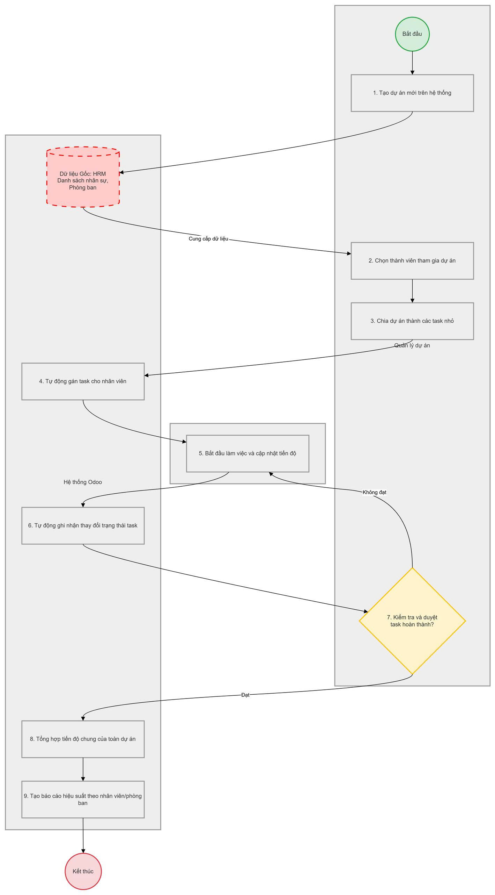

# erp-stask-tracking

## Giới thiệu

Dự án này là một hệ thống theo dõi task cho ERP, hỗ trợ quản lý tiến độ công việc, phân công nhân sự và báo cáo hiệu suất.

Hình ảnh dưới đây mô tả luồng nghiệp vụ chính của hệ thống, từ tạo dự án, chọn thành viên, chia task, cập nhật tiến độ đến tổng hợp báo cáo.

## Sơ đồ luồng nghiệp vụ

## REAST API
1. Auth API
Method	Endpoint	Mục đích	Quyền
POST	/api/auth/register	Đăng ký tài khoản	Admin/HR
POST	/api/auth/login	Đăng nhập	Public
GET	/api/auth/me	Lấy thông tin user hiện tại	User
POST	/api/auth/logout	Đăng xuất	User
PUT	/api/auth/change-password	Đổi mật khẩu	User

Ví dụ login:

{
  "username": "admin",
  "password": "123456"
}
2. User / Role / Permission API
Method	Endpoint	Mục đích	Quyền
GET	/api/users	Danh sách tài khoản	Admin
GET	/api/users/{id}	Chi tiết user	Admin
PUT	/api/users/{id}	Cập nhật user	Admin
PUT	/api/users/{id}/lock	Khóa tài khoản	Admin
GET	/api/roles	Danh sách role	Admin
POST	/api/roles	Tạo role	Admin
POST	/api/users/{id}/roles	Gán role cho user	Admin
GET	/api/permissions	Danh sách quyền	Admin
3. HRM API
Method	Endpoint	Mục đích	Quyền
GET	/api/departments	Danh sách phòng ban	HR/Admin/PM
POST	/api/departments	Tạo phòng ban	HR/Admin
PUT	/api/departments/{id}	Sửa phòng ban	HR/Admin
GET	/api/employees	Danh sách nhân viên	HR/Admin/PM
POST	/api/employees	Tạo nhân viên	HR/Admin
GET	/api/employees/{id}	Chi tiết nhân viên	HR/Admin/PM
PUT	/api/employees/{id}	Sửa nhân viên	HR/Admin
PUT	/api/employees/{id}/status	Cập nhật trạng thái làm việc	HR/Admin

Ví dụ tạo nhân viên:

{
  "employee_code": "EMP001",
  "full_name": "Bui Quang Truong",
  "email": "truong@example.com",
  "phone": "0123456789",
  "job_position": "Backend Developer",
  "department_id": 1,
  "manager_id": 2,
  "status": "active",
  "hourly_rate": 50000
}
4. Client API
Method	Endpoint	Mục đích	Quyền
GET	/api/clients	Danh sách khách hàng	Admin/PM
POST	/api/clients	Tạo khách hàng	Admin/PM
GET	/api/clients/{id}	Chi tiết khách hàng	Admin/PM
PUT	/api/clients/{id}	Sửa khách hàng	Admin/PM
5. Project API
Method	Endpoint	Mục đích	Quyền
GET	/api/projects	Danh sách dự án	Admin/PM/Director
POST	/api/projects	Tạo dự án	PM/Admin
GET	/api/projects/{id}	Chi tiết dự án	Thành viên dự án
PUT	/api/projects/{id}	Cập nhật dự án	PM/Admin
DELETE	/api/projects/{id}	Xóa dự án	Admin
POST	/api/projects/{id}/members	Thêm thành viên dự án	PM/Admin
DELETE	/api/projects/{id}/members/{employee_id}	Xóa thành viên	PM/Admin
GET	/api/projects/{id}/progress	Xem tiến độ dự án	PM/Director

Ví dụ tạo dự án:

{
  "project_code": "PRJ001",
  "name": "ERP Task Tracking",
  "description": "Hệ thống quản lý dự án và công việc",
  "client_id": 1,
  "start_date": "2026-05-25",
  "end_date": "2026-06-30",
  "budget": 50000000,
  "project_manager_id": 1
}
6. Task API
Method	Endpoint	Mục đích	Quyền
GET	/api/tasks	Danh sách task	User
POST	/api/tasks	Tạo task	PM/Admin
GET	/api/tasks/{id}	Chi tiết task	Người liên quan
PUT	/api/tasks/{id}	Sửa task	PM/Admin
PUT	/api/tasks/{id}/status	Cập nhật trạng thái task	Assignee/PM
PUT	/api/tasks/{id}/progress	Cập nhật tiến độ	Assignee
PUT	/api/tasks/{id}/approve	Duyệt hoàn thành task	PM
DELETE	/api/tasks/{id}	Xóa task	PM/Admin

Ví dụ tạo task:

{
  "project_id": 1,
  "title": "Thiết kế database",
  "description": "Thiết kế ERD và schema PostgreSQL",
  "assignee_id": 3,
  "created_by": 1,
  "priority": "high",
  "status": "todo",
  "progress": 0,
  "estimated_hours": 8,
  "start_date": "2026-05-25",
  "deadline": "2026-05-28"
}
7. Task Dependency API
Method	Endpoint	Mục đích	Quyền
POST	/api/tasks/{id}/dependencies	Thêm task phụ thuộc	PM
GET	/api/tasks/{id}/dependencies	Xem phụ thuộc task	User
DELETE	/api/tasks/{id}/dependencies/{dependency_id}	Xóa phụ thuộc	PM
8. Comment / Attachment API
Method	Endpoint	Mục đích	Quyền
GET	/api/tasks/{id}/comments	Xem bình luận task	Thành viên
POST	/api/tasks/{id}/comments	Thêm bình luận	Thành viên
GET	/api/tasks/{id}/attachments	Xem file đính kèm	Thành viên
POST	/api/tasks/{id}/attachments	Upload file	Thành viên
DELETE	/api/attachments/{id}	Xóa file	Người upload/PM
9. Timesheet API
Method	Endpoint	Mục đích	Quyền
GET	/api/timesheets	Danh sách timesheet	HR/PM/Admin
POST	/api/timesheets	Nhân viên ghi giờ làm	Employee
GET	/api/tasks/{id}/timesheets	Giờ làm theo task	PM/Assignee
GET	/api/employees/{id}/timesheets	Giờ làm theo nhân viên	HR/PM

Ví dụ ghi timesheet:

{
  "task_id": 1,
  "employee_id": 3,
  "work_date": "2026-05-25",
  "hours_spent": 4.5,
  "description": "Thiết kế bảng employees, users, roles"
}
10. Notification API
Method	Endpoint	Mục đích	Quyền
GET	/api/notifications	Xem thông báo của tôi	User
PUT	/api/notifications/{id}/read	Đánh dấu đã đọc	User
POST	/api/notifications/check-overdue	Quét task quá hạn	System/Admin
11. Report / Dashboard API
Method	Endpoint	Mục đích	Quyền
GET	/api/reports/project-progress	Báo cáo tiến độ dự án	PM/Director
GET	/api/reports/employee-performance	Hiệu suất nhân viên	HR/PM/Director
GET	/api/reports/department-performance	Hiệu suất phòng ban	HR/Director
GET	/api/reports/project-cost	Chi phí dự án	PM/Director
GET	/api/dashboard/summary	Tổng quan dashboard	User theo quyền
12. WebSocket API

Dùng cho realtime:

/ws/notifications
/ws/projects/{project_id}
/ws/tasks/{task_id}

Sự kiện cần có:

task_created
task_updated
task_status_changed
task_overdue
comment_created
notification_created
project_progress_updated
MVP nên làm trước

Bạn nên làm theo thứ tự:

1. Auth
2. Employees + Departments
3. Projects
4. Project Members
5. Tasks
6. Task Status + Progress
7. Timesheets
8. Reports đơn giản
9. Notifications
10. WebSocket

## Cấu trúc json

1. AUTH API
POST /api/auth/register
Request
{
  "employee_id": 1,
  "username": "truongdev",
  "email": "truong@gmail.com",
  "password": "123456"
}
Response
{
  "message": "User created successfully",
  "user": {
    "id": 1,
    "username": "truongdev",
    "email": "truong@gmail.com"
  }
}
POST /api/auth/login
Request
{
  "username": "truongdev",
  "password": "123456"
}
Response
{
  "access_token": "jwt_token_here",
  "token_type": "bearer",
  "user": {
    "id": 1,
    "username": "truongdev",
    "roles": [
      "project_manager"
    ]
  }
}
2. DEPARTMENTS API
POST /api/departments
Request
{
  "name": "Backend",
  "description": "Backend Development Department"
}
Response
{
  "id": 1,
  "name": "Backend",
  "description": "Backend Development Department"
}
GET /api/departments
Response
[
  {
    "id": 1,
    "name": "Backend"
  },
  {
    "id": 2,
    "name": "Frontend"
  }
]
3. EMPLOYEES API
POST /api/employees
Request
{
  "employee_code": "EMP001",
  "full_name": "Bui Quang Truong",
  "email": "truong@gmail.com",
  "phone": "0123456789",
  "job_position": "Backend Developer",
  "department_id": 1,
  "manager_id": 2,
  "status": "active",
  "hourly_rate": 50000
}
Response
{
  "id": 1,
  "employee_code": "EMP001",
  "full_name": "Bui Quang Truong",
  "department": {
    "id": 1,
    "name": "Backend"
  }
}
GET /api/employees/1
Response
{
  "id": 1,
  "employee_code": "EMP001",
  "full_name": "Bui Quang Truong",
  "email": "truong@gmail.com",
  "job_position": "Backend Developer",
  "department": {
    "id": 1,
    "name": "Backend"
  },
  "manager": {
    "id": 2,
    "full_name": "Nguyen Van A"
  }
}
4. CLIENTS API
POST /api/clients
Request
{
  "name": "FPT Software",
  "email": "contact@fpt.com",
  "phone": "0901234567",
  "address": "Ha Noi",
  "tax_code": "123456789"
}
Response
{
  "id": 1,
  "name": "FPT Software"
}
5. PROJECTS API
POST /api/projects
Request
{
  "project_code": "PRJ001",
  "name": "ERP Task Tracking",
  "description": "ERP project management system",
  "client_id": 1,
  "start_date": "2026-05-25",
  "end_date": "2026-06-30",
  "budget": 50000000,
  "project_manager_id": 1
}
Response
{
  "id": 1,
  "project_code": "PRJ001",
  "name": "ERP Task Tracking",
  "status": "planning"
}
GET /api/projects
Response
[
  {
    "id": 1,
    "project_code": "PRJ001",
    "name": "ERP Task Tracking",
    "status": "in_progress",
    "progress": 75
  }
]
6. PROJECT MEMBERS API
POST /api/projects/1/members
Request
{
  "employee_id": 3,
  "project_role_id": 2,
  "hourly_rate": 70000
}
Response
{
  "message": "Member added successfully"
}
7. TASKS API
POST /api/tasks
Request
{
  "project_id": 1,
  "title": "Design PostgreSQL Database",
  "description": "Design ERP database schema",
  "assignee_id": 3,
  "created_by": 1,
  "priority": "high",
  "status": "todo",
  "progress": 0,
  "estimated_hours": 8,
  "start_date": "2026-05-25",
  "deadline": "2026-05-28"
}
Response
{
  "id": 1,
  "title": "Design PostgreSQL Database",
  "status": "todo"
}
PUT /api/tasks/1/status
Request
{
  "status": "in_progress"
}
Response
{
  "message": "Task status updated"
}
PUT /api/tasks/1/progress
Request
{
  "progress": 60
}
Response
{
  "message": "Task progress updated"
}
GET /api/tasks/1
Response
{
  "id": 1,
  "title": "Design PostgreSQL Database",
  "description": "Design ERP database schema",
  "status": "in_progress",
  "progress": 60,
  "priority": "high",
  "estimated_hours": 8,
  "assignee": {
    "id": 3,
    "full_name": "Bui Quang Truong"
  }
}
8. TASK DEPENDENCIES API
POST /api/tasks/1/dependencies
Request
{
  "depends_on_task_id": 2
}
Response
{
  "message": "Dependency added"
}
9. TASK COMMENTS API
POST /api/tasks/1/comments
Request
{
  "content": "Database schema completed"
}
Response
{
  "id": 1,
  "content": "Database schema completed",
  "employee": {
    "id": 3,
    "full_name": "Bui Quang Truong"
  }
}
10. ATTACHMENTS API
POST /api/tasks/1/attachments
Request
{
  "file_name": "database_design.pdf",
  "file_url": "/uploads/database_design.pdf",
  "file_type": "application/pdf"
}
Response
{
  "id": 1,
  "file_name": "database_design.pdf"
}
11. TIMESHEETS API
POST /api/timesheets
Request
{
  "task_id": 1,
  "employee_id": 3,
  "work_date": "2026-05-25",
  "hours_spent": 4.5,
  "description": "Designed employee and task tables"
}
Response
{
  "id": 1,
  "hours_spent": 4.5
}
12. NOTIFICATIONS API
GET /api/notifications
Response
[
  {
    "id": 1,
    "title": "Task Overdue",
    "message": "Task Design API is overdue",
    "is_read": false
  }
]
PUT /api/notifications/1/read
Response
{
  "message": "Notification marked as read"
}
13. REPORT API
GET /api/reports/project-progress
Response
{
  "total_projects": 10,
  "completed_projects": 6,
  "in_progress_projects": 3,
  "cancelled_projects": 1
}
GET /api/reports/employee-performance
Response
[
  {
    "employee_id": 3,
    "employee_name": "Bui Quang Truong",
    "completed_tasks": 15,
    "total_hours": 120,
    "performance_score": 92
  }
]
14. DASHBOARD API
GET /api/dashboard/summary
Response
{
  "total_employees": 50,
  "total_projects": 10,
  "total_tasks": 150,
  "completed_tasks": 90,
  "overdue_tasks": 12
}
15. WEBSOCKET EVENT FORMAT
Task Updated Event
{
  "event": "task_updated",
  "task_id": 1,
  "project_id": 1,
  "status": "in_progress",
  "progress": 60,
  "updated_by": {
    "id": 3,
    "name": "Bui Quang Truong"
  },
  "timestamp": "2026-05-25T08:30:00"
}
JSON Response Standard

Bạn nên thống nhất toàn hệ thống:

Success
{
  "success": true,
  "message": "Data fetched successfully",
  "data": {}
}
Error
{
  "success": false,
  "message": "Permission denied",
  "errors": []
}
## Cấu trúc ERP API tốt nhất
HEADER
├── Authorization
└── Content-Type

PATH PARAM
└── resource id

QUERY PARAM
├── filter
├── search
├── sort
└── pagination

BODY
├── create
├── update
└── complex data